# Outlier Detection in the BedMap Dataset

## Semi-Supervised GNN Component

Repository: [Outlier-Detection-in-the-BedMap-Dataset](https://github.com/holger-kch/Outlier-Detection-in-the-BedMap-Dataset)

This repository contains the Graph Neural Network part of the BedMap outlier
detection project. The goal is to score every ice-thickness measurement in the
BedMap-style Antarctic survey dataset for whether it behaves like a measurement
outlier when compared with its physical variables and spatial neighbours.

The project starts from pseudo-labels rather than hand labels. A physics/support
selection identifies high-confidence outlier and inlier seeds. A semi-supervised
GraphSAGE model then learns from those seeds on a k-nearest-neighbour graph and
assigns an outlier probability to all `74,747,031` points.

Figure scope follows the final presentation: slides 1-4 are explained as
context, and the tracked figures are restricted to Holger's GNN/pseudo-label
material inside slides 7-16 and Appendix 10-18. Slide 7 is the group's
along-track kNN spike-detection method, so it is left out of this GNN-focused
repository.

README figures are shown full-width where possible and can be clicked to open
the full-resolution PNG.

The GNN is trained from pseudo-labels: geometry/physics rules create
high-confidence inlier and outlier seeds before any neural model is used.

<a href="figures/readme/ice_thickness_outlier_seeds.png">
  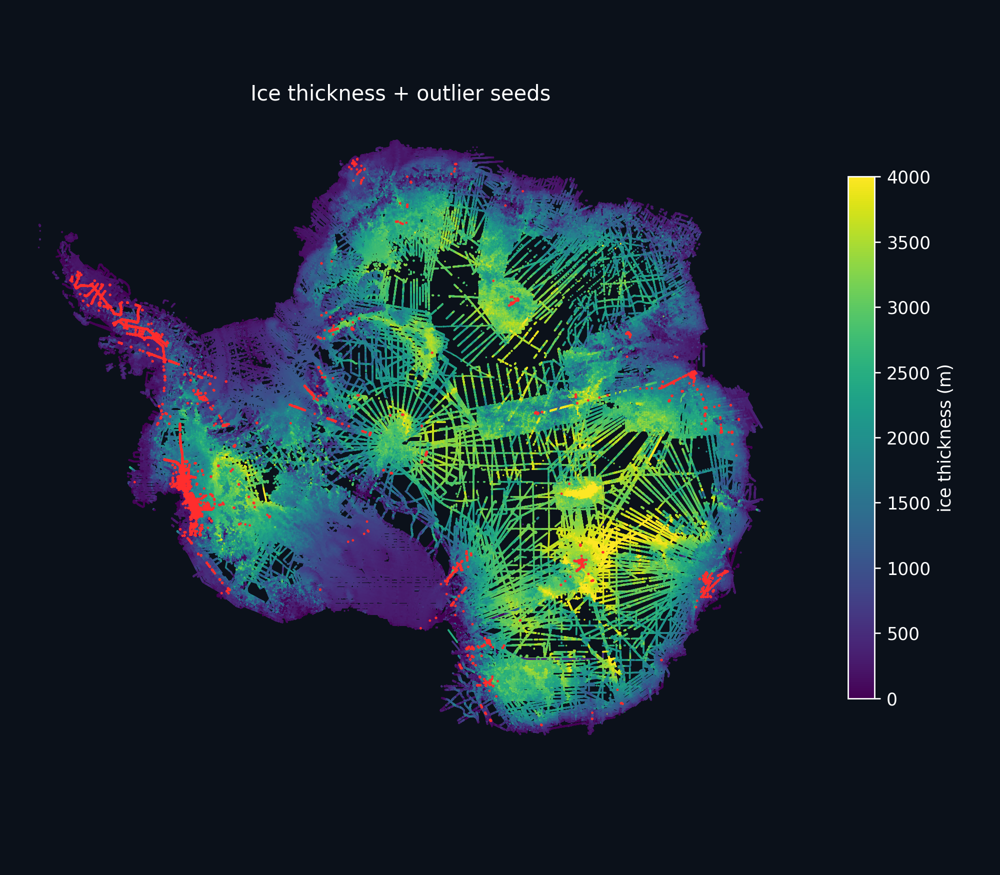
</a>

This is the supervision set for the GNN. The pseudo-label pipeline reduces the
raw double-hit candidates to a small set of high-confidence inlier and outlier
seeds. Code: [step1_2_candidates_support.py](src/pipeline/step1_2_candidates_support.py)
and [make_seed_map.py](src/pipeline/make_seed_map.py).

The final scoring pass marks high-probability model outliers in red on top of
the ice-thickness map. At `p_outlier >= 0.7`, the GNN flags `702,675` points.

<a href="figures/readme/ice_thickness_gnn_outliers_thr0p7.png">
  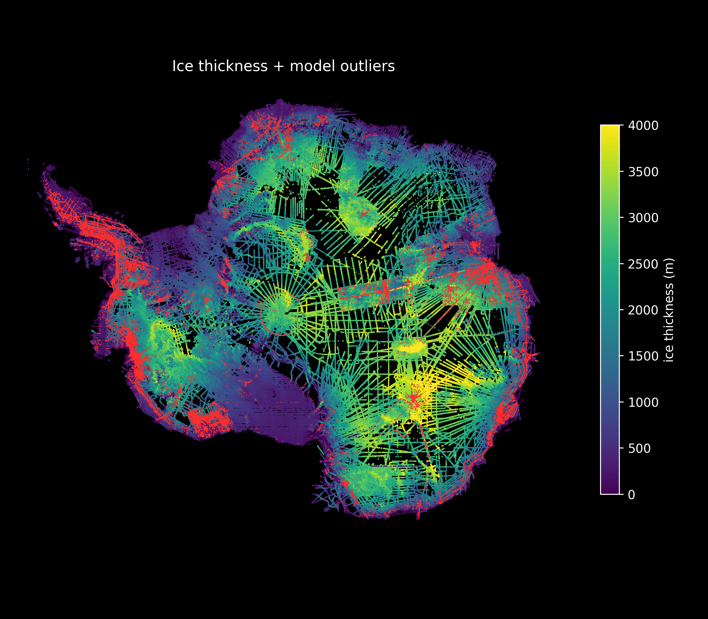
</a>

This is the final model output, not another seed map. Every point has been
scored out-of-fold, and the red points are the high-confidence candidates at
`p_outlier >= 0.7`. Code:
[physae_gnn_v4.py](src/pipeline/physae_gnn_v4.py) and
[make_ice_thickness_physae_outlier_map.py](src/presentation/make_ice_thickness_physae_outlier_map.py).

## Project Context

BedMap collects Antarctic ice-thickness measurements from many survey campaigns
spanning decades. The core measurement comes from airborne radio echo sounding:
a VHF signal is sent through the ice, the bed echo is recorded, and travel time
is converted to ice thickness.

That history makes the dataset valuable, but also messy. The project targets
measurement errors such as sudden unphysical jumps along a track or local
disagreements between nearby independent tracks. Those errors matter because
ice-thickness fields are inputs to downstream Antarctic and climate modelling.

The GNN does not see only thickness. It uses a small set of physical variables
available for each point, including ice thickness, bed/surface geometry, flow,
surface slope, surface mass balance, and temperature. Coordinates are used to
build the graph edges, not as node features.

## Main Result

The GNN was evaluated by cross-region validation: train on one large spatial
region, test on the other, then mirror the split. Region membership is only used
to define the held-out folds; it is not a model feature.

| Test direction | Outlier seeds | Inlier seeds | AUC | Recall at 0.5 | FPR at 0.5 |
|---|---:|---:|---:|---:|---:|
| Model B on region A | 19,317 | 247,192 | 0.865 | 0.850 | 0.314 |
| Model A on region B | 19,564 | 399,482 | 0.858 | 0.519 | 0.055 |

Full-map inference:

| Threshold | Flagged points |
|---:|---:|
| `p_outlier >= 0.5` | 1,951,535 |
| `p_outlier >= 0.7` | 702,675 |
| `p_outlier >= 0.9` | 34,500 |

The useful outcome is not that every red point is automatically a confirmed
bad measurement. The useful outcome is a continent-wide prioritised candidate
list: the GNN transfers the pseudo-label signal from local seed regions to the
full survey graph.

## How The GNN Is Built

The overview slide reduces the method to a semi-supervised node-classification
problem: red/green pseudo-label seeds supervise training on the graph, grey
nodes are unlabeled during training, and the trained model later scores every
node.

<a href="figures/readme/gnn_thumb.png">
  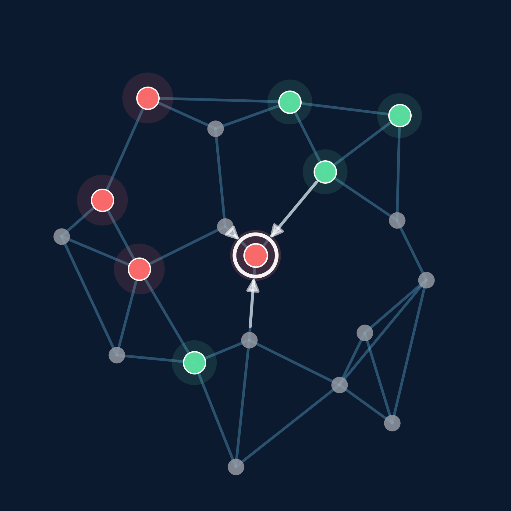
</a>

The red and green nodes are the seed labels; grey nodes are unlabeled. Message
passing lets labelled neighbourhood structure influence the score of a target
node. Code: [make_gnn_thumb.py](src/presentation/make_gnn_thumb.py) and
[physae_gnn_v4.py](src/pipeline/physae_gnn_v4.py).

### 1. Pseudo-Labels

The model does not use manually labelled outliers. It uses seed labels produced
by a physics/support pipeline:

- `38,881` outlier seeds,
- `646,674` inlier seeds,
- roughly `74M` remaining unlabeled nodes.

The seed-selection code is in [src/pipeline/step1_2_candidates_support.py](src/pipeline/step1_2_candidates_support.py),
with inspection and summary helpers in [src/pipeline/analyze_step1_2_labels.py](src/pipeline/analyze_step1_2_labels.py)
and [src/pipeline/make_seed_map.py](src/pipeline/make_seed_map.py).

The support rule is: gather nearby measurements within 2 km, keep candidate
pairs only when the local support has at least 5 tracks, 2 surveys, and 100
support points, and remove support points that fail the 4-nearest-neighbour
depth-change check. The cone/band test then decides whether the candidate is
consistent with the local support or should become an outlier seed.

<a href="figures/readme/double_hit.png">
  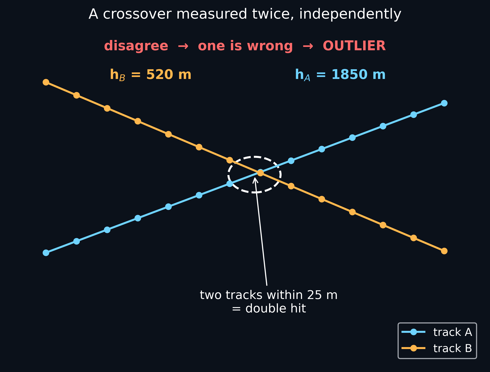
</a>

This is the first seed idea: two independent survey tracks measure nearly the
same location. Agreement gives an inlier candidate; a large disagreement gives
an outlier candidate, but only after the local support tests below. Code:
[step1_2_candidates_support.py](src/pipeline/step1_2_candidates_support.py).

<a href="figures/readme/support_relation.png">
  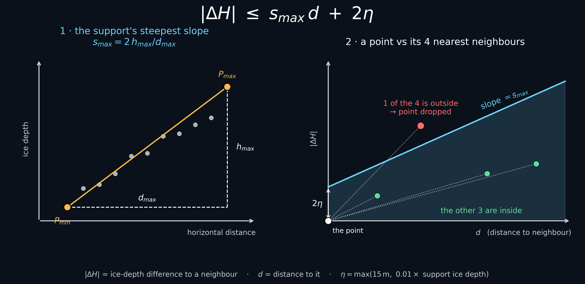
</a>

The support relation sets the local slope tolerance. The left panel estimates
how steep the nearby support can be; the right panel checks whether neighbouring
points are compatible with that tolerance. Code:
[step1_2_candidates_support.py](src/pipeline/step1_2_candidates_support.py)
and [make_pseudolabel_figs.py](src/presentation/make_pseudolabel_figs.py).

<a href="figures/readme/cone.png">
  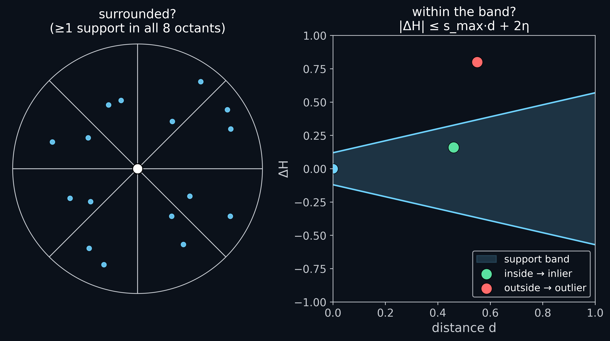
</a>

The cone verdict prevents isolated or one-sided support from becoming a seed.
An inlier seed needs surrounding support and must sit inside the local band; an
outlier seed needs surrounding support and must fail the band test. Code:
[step1_2_candidates_support.py](src/pipeline/step1_2_candidates_support.py).

<a href="figures/readme/ice_thickness_outlier_seeds.png">
  
</a>

This is the result of the pseudo-label filtering used for training:
`38,881` outlier seeds and `646,674` inlier seeds. Code:
[make_seed_map.py](src/pipeline/make_seed_map.py).

### 2. Physics-Only Node Features

The GNN input deliberately avoids coordinates, track identifiers, time, and
survey metadata that could become shortcuts. It also avoids BedMachine
thickness/residual columns as model inputs. Node features are built from
physics/geophysical variables available in the BedMap-style table:

- measured ice thickness,
- bed elevation,
- geometric residuals,
- surface-minus-bed thickness,
- log speed and flow direction,
- surface slope and elevation,
- surface mass balance,
- temperature,
- missing-value mask bits.

The feature construction lives in [src/pipeline/physae_prepare_v4.py](src/pipeline/physae_prepare_v4.py).
The exact feature statistics from the run are kept in
[results/physae_feature_stats_v4.json](results/physae_feature_stats_v4.json).

<a href="figures/readme/gnn_features.png">
  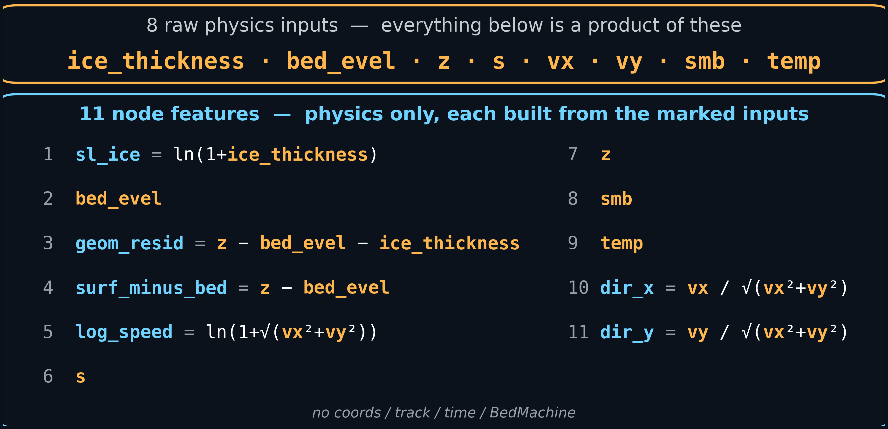
</a>

The feature table shows the variables the model is allowed to use. Coordinates,
track identifiers, time, and labels are excluded from node features so the model
learns physical consistency rather than metadata shortcuts. Code:
[physae_prepare_v4.py](src/pipeline/physae_prepare_v4.py).

### 3. k-NN Spatial Graph

The graph connects each point to `k = 16` spatial neighbours. The node index is
the source row id in the original BedMap table. Edge attributes are:

- `log1p_dist`, the log-scaled spatial distance,
- `signed_grad_scaled`, the signed ice-thickness gradient across the edge.

The graph build scripts are [src/pipeline/build_spatial_graph_v3.py](src/pipeline/build_spatial_graph_v3.py)
and [src/pipeline/make_k16_edge_cache.py](src/pipeline/make_k16_edge_cache.py).
The run metadata are in [results/spatial_edges_v3_meta.json](results/spatial_edges_v3_meta.json)
and [results/physae_edge_attr_v4_k16_meta.json](results/physae_edge_attr_v4_k16_meta.json).

<a href="figures/readme/knn_map.png">
  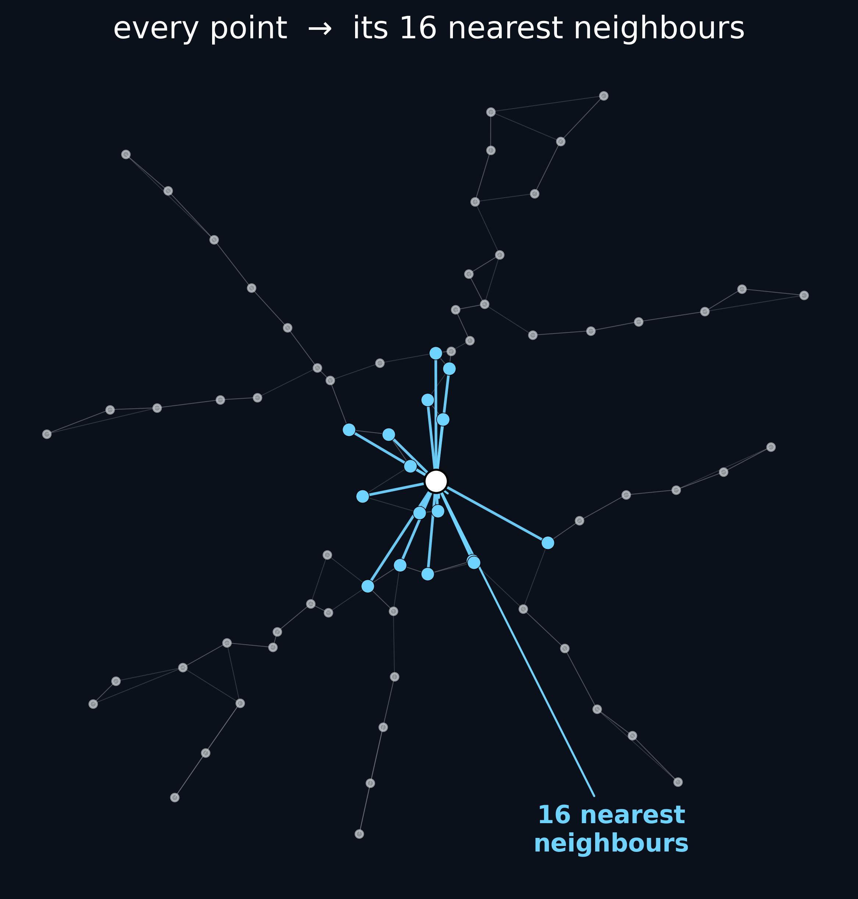
</a>

The graph connects each measurement to its 16 nearest spatial neighbours. This
is what lets the GNN compare a point with nearby measurements rather than score
each point in isolation. Code:
[build_spatial_graph_v3.py](src/pipeline/build_spatial_graph_v3.py).

<a href="figures/readme/edge_table.png">
  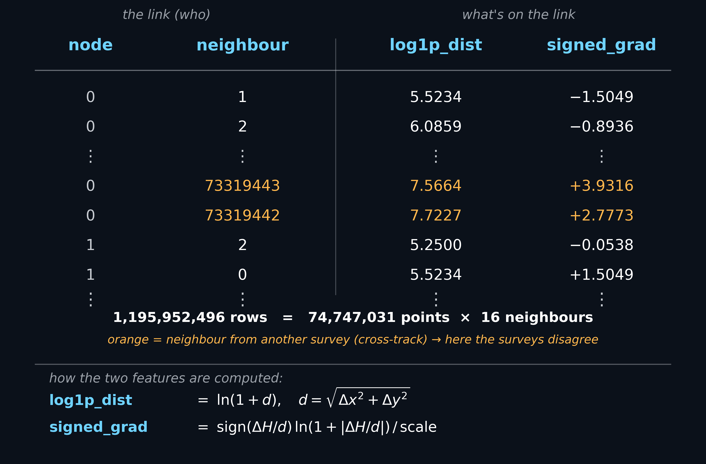
</a>

Each edge carries distance and signed ice-thickness gradient. The signed
gradient helps distinguish smooth terrain changes from sharp local jumps. Code:
[physae_prepare_v4.py](src/pipeline/physae_prepare_v4.py) and
[make_k16_edge_cache.py](src/pipeline/make_k16_edge_cache.py).

### 4. Edge-Gated GraphSAGE

The model is an edge-aware GraphSAGE classifier. Message passing lets the model
compare each measurement with nearby measurements, while edge attributes tell it
how far the neighbour is and whether the thickness change looks like a smooth
gradient or a sharp jump.

The implementation is in [src/pipeline/physae_gnn_v4.py](src/pipeline/physae_gnn_v4.py).
Hyperparameter search code is in [src/pipeline/optuna_physae_v4.py](src/pipeline/optuna_physae_v4.py),
and the selected configuration is stored in [results/optuna_best_v4.json](results/optuna_best_v4.json).

<a href="figures/readme/gnn_model.png">
  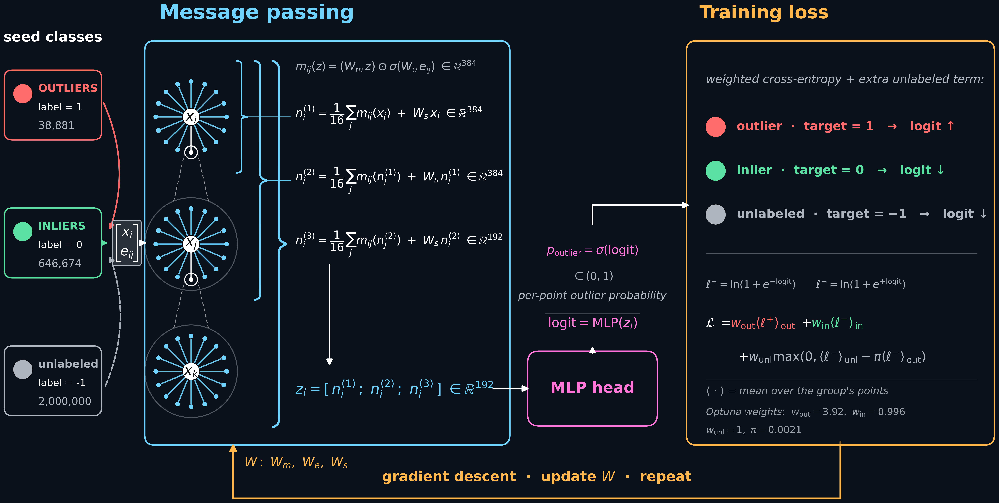
</a>

The model learns from outlier seeds, inlier seeds, and unlabeled nodes. Edge
attributes gate the neighbour messages before the node classifier produces
`p_outlier`. Code: [physae_gnn_v4.py](src/pipeline/physae_gnn_v4.py)
and [optuna_physae_v4.py](src/pipeline/optuna_physae_v4.py).

### 5. Cross-Region Validation

The validation asks whether a model trained in one spatial region can recover
seeds in the other region. This is harder and more meaningful than testing on
nearby points from the same survey area.

Validation code:

- [src/pipeline/validate_physae_v4.py](src/pipeline/validate_physae_v4.py)
- [src/presentation/physae_cross_region_seed_scores.py](src/presentation/physae_cross_region_seed_scores.py)
- [src/presentation/make_physae_cross_region_roc.py](src/presentation/make_physae_cross_region_roc.py)
- [src/presentation/make_physae_logit_distribution.py](src/presentation/make_physae_logit_distribution.py)
- [src/presentation/make_physae_confusion_matrix.py](src/presentation/make_physae_confusion_matrix.py)

<a href="figures/readme/physae_training_history.png">
  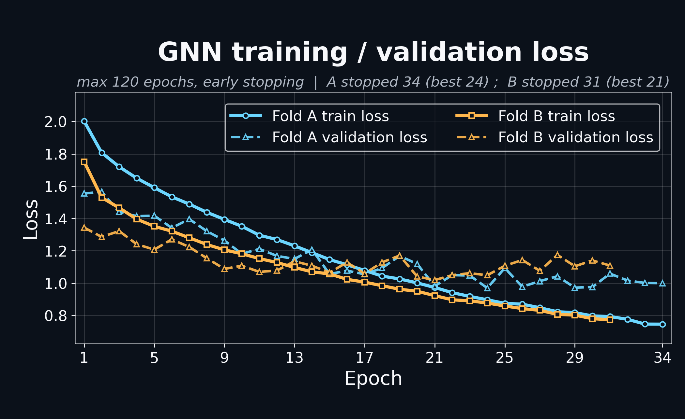
</a>

The training curves show both folds converging under the same selected Optuna
configuration. The two-fold setup is used so final scores can be produced
out-of-fold. Code:
[make_physae_training_history.py](src/presentation/make_physae_training_history.py).

<a href="figures/readme/physae_cross_region_roc.png">
  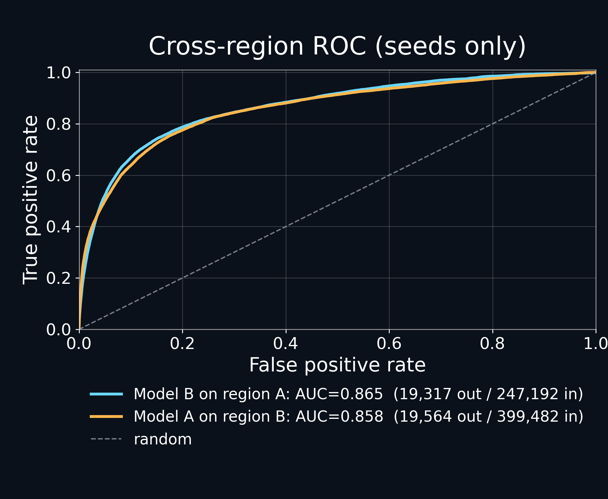
</a>

The ROC plot tests whether a model trained in one spatial region can recover
seed labels in the other region. This is the main generalisation check. Code:
[validate_physae_v4.py](src/pipeline/validate_physae_v4.py) and
[make_physae_cross_region_roc.py](src/presentation/make_physae_cross_region_roc.py).

<a href="figures/readme/physae_cross_region_logit_distribution.png">
  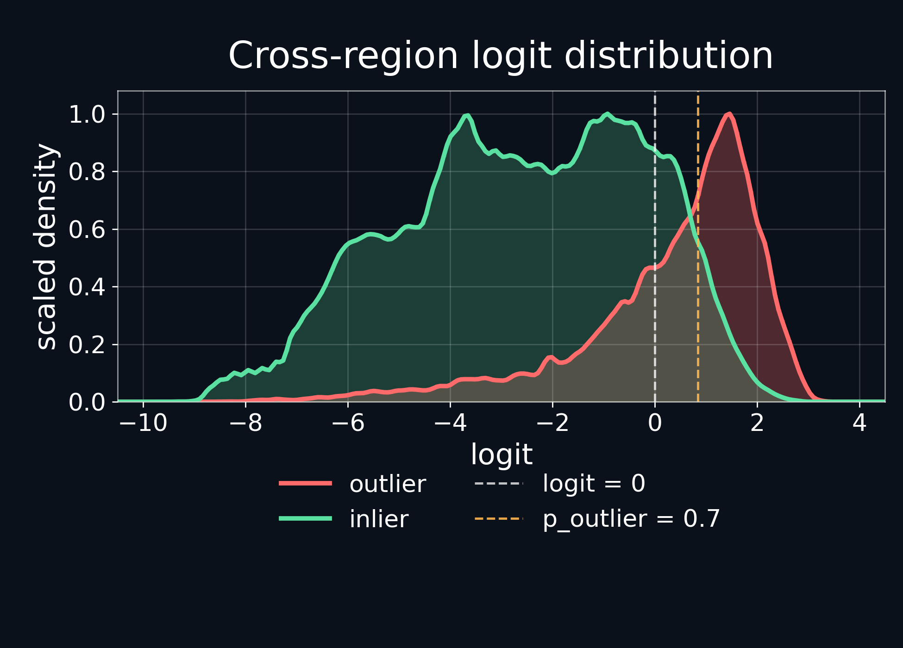
</a>

The logit distribution shows the separation between held-out outlier and inlier
seeds before thresholding. Code:
[physae_cross_region_seed_scores.py](src/presentation/physae_cross_region_seed_scores.py)
and [make_physae_logit_distribution.py](src/presentation/make_physae_logit_distribution.py).

<a href="figures/readme/physae_cross_region_confusion_matrix.png">
  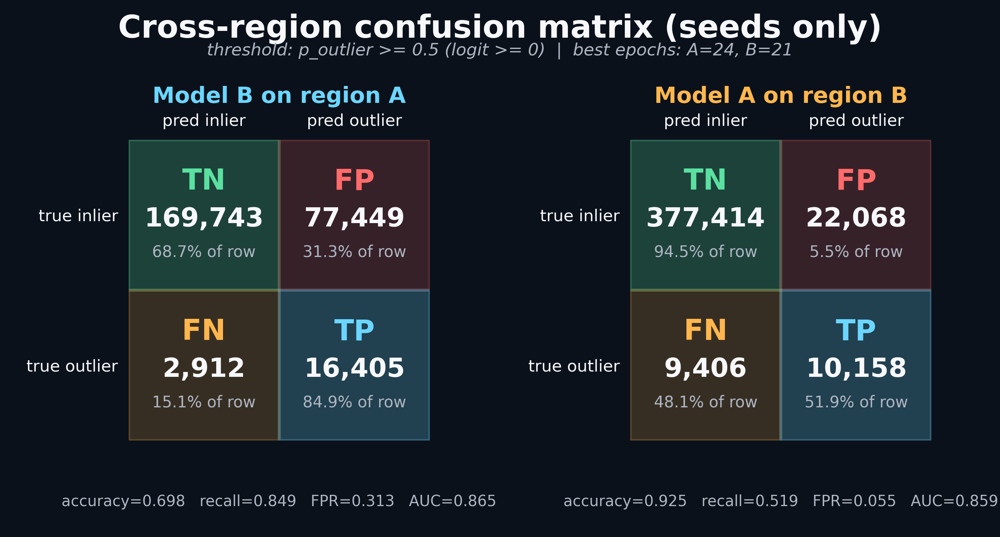
</a>

The confusion matrices show the practical threshold behaviour at
`p_outlier = 0.5` for each held-out region. Code:
[make_physae_confusion_matrix.py](src/presentation/make_physae_confusion_matrix.py).

### 6. Full-Map Scoring

The final inference script scores all `74,747,031` nodes and writes a
point-level `p_outlier`. The plotting script overlays the high-score points on
the ice-thickness map.

Code:

- [src/pipeline/physae_gnn_v4.py](src/pipeline/physae_gnn_v4.py) for inference mode,
- [src/presentation/make_ice_thickness_physae_outlier_map.py](src/presentation/make_ice_thickness_physae_outlier_map.py)
  for the map.

<a href="figures/readme/ice_thickness_gnn_outliers_thr0p7.png">
  
</a>

This map applies the trained cross-fit models to all `74,747,031` points. It is
the candidate list that would be inspected next, not a claim that every red
point is manually confirmed. Code:
[physae_gnn_v4.py](src/pipeline/physae_gnn_v4.py) and
[make_ice_thickness_physae_outlier_map.py](src/presentation/make_ice_thickness_physae_outlier_map.py).

## Code And Figure References

Every figure shown in this README is mapped to its slide source and generating
script in [docs/figure_index.md](docs/figure_index.md). The slide-by-slide
coverage check is in [docs/slide_coverage.md](docs/slide_coverage.md), and the
analysis workflow is mapped from pseudo-labels to full-map scoring in
[docs/code_map.md](docs/code_map.md).

## Repository Layout

```text
.
├── src/
│   ├── pipeline/       # seed, graph, feature, GNN, validation code
│   ├── presentation/   # scripts that generated the GNN figures
│   └── slurm/          # cluster job wrappers for the GNN run
├── figures/
│   ├── pseudolabels/   # pseudo-label figures from slides/appendix
│   ├── gnn/            # original GNN diagrams
│   ├── results/        # result figures
│   └── readme/         # dark-background previews for GitHub
├── results/            # small JSON metadata and metrics
└── docs/               # navigation and reproduction notes
```

The full BedMap table, derived graph arrays, score parquets, model checkpoints,
logs, PowerPoint files, decorative backgrounds, and presentation build products
are intentionally not tracked.

## Navigation

- [docs/code_map.md](docs/code_map.md) maps each scientific step to code.
- [docs/figure_index.md](docs/figure_index.md) maps each figure to the script
  that generated it.
- [docs/slide_coverage.md](docs/slide_coverage.md) states exactly which
  requested slides are represented by text, code, and figures.
- [docs/results_summary.md](docs/results_summary.md) collects the key numbers.
- [docs/reproduction_notes.md](docs/reproduction_notes.md) explains what is
  needed to rerun the analysis on the original cluster environment.

## Scope

This repository focuses only on the GNN component. Other project components
from the group presentation, such as along-track kNN spike detection, PCA,
latent-space carving, graph autoencoder work, ensemble slides, and decorative
PowerPoint backgrounds, are deliberately excluded.

## Note

This GitHub repository was assembled and documented with Codex, based on
Holger K. Christiansen's final project presentation and the associated analysis
code from the original cluster project.
